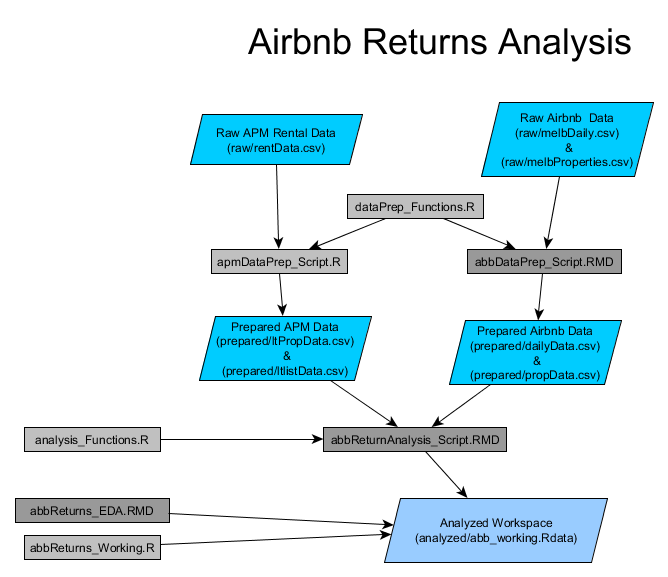

# Airbnb Returns in Melbourne 
## (airbnbMelbourne)

Analysis of Airbnb Market in Melbourne, Australia

## Process

The overall analytical process completed to date is shown in the diagram below:

## Data

[Blue Quadrilaterals] 

Data for this project is held in our shared dropbox account.  There are three 'levels' of data.

1. **Raw:**  Raw data is straight from the source.  In the case of the APM rental data I have trimmed off some unnecessary columns simply to make the file size smaller.  No observations have been removed. 

2. **Prepared:**  Here the raw data has been passed through two data preparation scripts (*apmDataPrep_Script.R* and *abbDataPrep_Script.rmd*).  A variety of fields have been removed as well as added/created.  Observations with missing or outlier data have also been removed.  The APM long term rental data has been split into two files, one with the information on the final rental transactions (*ltpropdata.csv*) and one with all listing information (*ltlistdata.csv*) -- one observation per change to the listing. The Airbnb data is divided into two files here, one for information on each property (*propdata.csv*) and one with information on the daily status and rates (*dailydata.csv*).  The Airbnb data has been prepared by removing outliers and fields as well as having the missing nightly observations imputed.

3. **Analyzed:** Data that has been analzed in some way and can be used for futuring plotting or analytical purposes.  At the moment this contains an R workspace of the analysis up to the point where the *abbReturns_Script.rmd* file ends and the *abbReturns_working.R* file picks up.  This divisions represents the accepted code in the first file and the working analysis in the latter. 

## Code

[Grey Rectangles]

Code is held in this repository. There are (currently) seven code files:

1. **dataPrep_Functions.R**: A set of custom functions for data preparation used with both the Airbnb and the long-term rental data.

2. **apmDataPrep_Script.R**:  Script that prepares the APM data for further analysis.  Includes data cleaning, field transformation and addition. 

3. **abbDataPrep_Script.rmd**: Script that prepares the Airbnb data for further analysis.  Includes data cleaning and the imputation of missing daily observations. 

4. **analysis_Functions.R**: A set of custom functions to aid in the analysis of the Airbnb and long-term rental markets.  

5. **abbReturnAnalysis_Script.rmd**: Full analytical script for measuring returns from Airbnb versus those from long-term rentals.  

6. **abbReturns_EDA.rmd**: Script containing exploratory data analysis (EDA) that will not be included in the final analytical script.

7. **abbReturns_Working.R**: Script containing working analyses.  Once confirmed here, this code is added to the **abbReturnAnalysis_Script.rmd** and full annotated. 

## Output

More to come here.  Will be added to the flowchart as it is created. 

