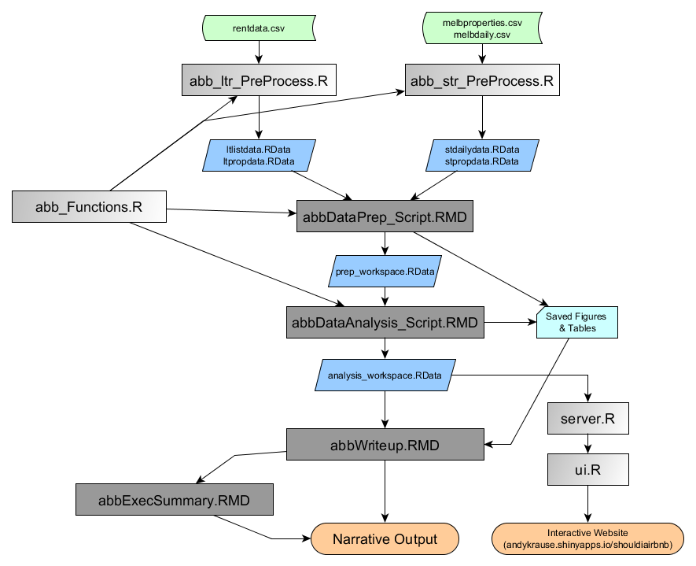

# Airbnb Returns in Melbourne 

This project details research into the financial feasibility of short-term leasing (Airbnb) against more traditional long-term leasing strategies in Melbourne, Australia.   The project is funded by a grant from the Real Estate Research Institute (RERI) of Chicago, Illinois. 

## Process

The overall analytical process completed to date is shown in the diagram below:

## Data

Data for this project is, unfortunately strictly licensed and cannot be openly shared.  There are four 'levels' of data.

[Green Rectangles]

1. **Raw:**  Raw data is straight from the source.  In the case of the APM rental data I have trimmed off some unnecessary columns simply to make the file size smaller.  No observations have been removed. 

[Blue Quadrilaterals]

2. **Processed:** Very basic and time consuming processes like date conversion, field standardization and merging is done in pre-processing stages.  The result of this is essentially raw data, but raw data that is ready to be prepared in a timely manner. The APM long term rental data has been split into two files, one with the information on the final rental transactions (*ltpropdata.csv*) and one with all listing information (*ltlistdata.csv*) -- one observation per change to the listing. The Airbnb data is divided into two files here, one for information on each property (*propdata.csv*) and one with information on the daily status and rates (*dailydata.csv*).

3. **Prepared:**  Here the processed datasets have been passed through the data preparation script (*abbDataPrep_Script.rmd*).  A variety of fields have been removed as well as added/created.  Observations with missing or outlier data have also been removed.  The Airbnb data has been prepared by removing outliers and fields as well as having the missing nightly observations imputed.

4. **Analyzed:** Data that has been fully analyzed and results are stored in an R workspace.  Results objects are available for futuring plotting or visualization that will occur in the writeup, executive summary or interactive website. 

## Code

[Grey Rectangles]

Code is held in this repository. There are (currently) nine code files:

1. **abb_ltr_PreProcess.R**:  Data pre-processing for the long-term rental data (APM data)

2. **abb_str_PreProcess.R**: Data pre-processing for the short-term rental data (Airbnb data)

3. **abb_Functions.R**: A set of custom functions for data preparation, analysis and visualization.

4. **abbDataPrep_Script.RMD**:  A literate programming script that detailes the data preparation actions taken. 

5. **abbDataAnalysis_Script.RMD**: A literate programming script that details the data analysis actions taken. 

6. **abbWriteup.RMD**: Narrative writeup of the study, including visualizations.  

7. **abbExecSummary.RMD**: Executive summary of the study's findings.  

8. **server.R**: Server functions for the Shiny Apps interactive website.

9. **ui.R**: User Interface functions for the Shiny Apps interactive website. 

## Output

There are three audience-friendly outputs and two more complex descriptions of the research process.  The audience friendly outputs include the full narrative report (generated by **abbWriteup.RMD**), the executive summary (**abbExecSummary**) and the interactive website at [andykrause.shinyapps.io/ShouldIAirbnb](https://andykrause.shinyapps.io/ShouldIAirbnb).

The two more complex outputs are the literature programming files of the data preparation (**abbDataPrep_Script.RMD**) and data analysis (**abbDataAnalysis_Script.RMD**).

